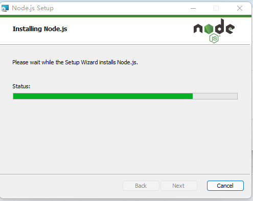
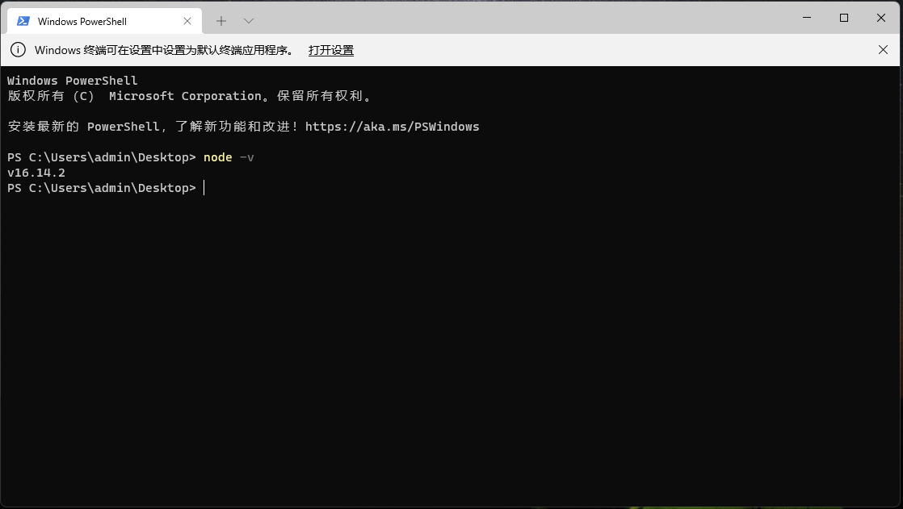

# Nodejs

## 介绍

 Node.js 是一个基于 Chrome V8 引擎的 JavaScript  运行环境 , 是一款软件


- JavaScript 是语言

- Node.js 不是语言,是应用程序

**官方网址** **:** https://nodejs.org/en/

**中文网** **:** http://nodejs.cn/

## 系统中的node有什么作用

- 解析运行JS代码

- 操作的是系统资源,如内存 , 硬盘 , 网络


## 应用场景

- APP接口服务
- 网页聊天室
- 动态网站
- 后端web服务
- 前端资源打包

## 下载安装

官方下载,历史版本的下载https://npm.taobao.org/mirrors/node/

- v6 截止2019-4-30停止维护
- v8 截止2019-12-31停止维护
- v10 截止2021-4-01停止维护
- v12 截止2022-4-01停止维护
- v16 待定

Nodejs的版本号奇数为开发版本 , 偶数为发布版本 , 我们选择偶数号的LTS版本(长期维护 long term service)



默认安装路径C:/Program Files/nodejs ,**可以替换路径,但是不可以使用中文路径**

安装完成以后 , 在 terminal 窗口中**node -v** 查看版本.



<font color="red">注意:node环境当中不可以使用BOM和DOM , node中的全局对象是global</font>

## buffer缓冲器


**介绍**

Buffer(nodejs当中)是一个类似于数组的对象 , 不同的是

Buffer是专门用来保存二进制数据的.

**特点**

- 大小固定 : 在创建的时候就确定了,且无法调整
- 性能好 : 直接对计算机内存进行操作的

- 每个元素的大小为1byte(8bit)

**操作**

**创建Buffer对象**

- 直接创建 Buffer.alloc

- 不安全创建 Buffer.allocUnsafe

- 通过数组和字符串创建 Buffer.from

**读取和写入**

可以直接使用[]的方式对数据进行处理

- buf[0]可以对buf进行读取和设置
- buf.toString()将Buffer转换成字符串

**字符集**

码 表 地 址 : https://www.habaijian.com/ 

unicode码表:https://unicode-table.com/cn/

unicode汉子表:https://blog.csdn.net/u010811143/article/details/51560246

```
字符集 : 数字和符号的映射表(ASCII表)

ASCII码表 : 10进制对应 2进制对应 8进制对应 16进制对应 字符
0-255个字符表 一共可以表示256个字符
			|
			| 
			V
双字节码表 : gbk	gb2312	big5
0 - 65535 一共可以表示65536个字符
			|
			| 
			V
万国码 : unicode 字符集
行表2个16进制位	+ 列1个16进制位 = 3个16进制位# 00 00 00 = 10101010 10101010 10101010

衍生出一些表达方式是 :
utf8 : 一个字要使用3个字节utf8mb4 : 一个字要使用4个字节utf16 : 一个字要使用4个字节
```

## fs(文件)

fs : Files System文件系统 ,  它是node中的内置模块,可以对计算机中的文件进行增删改查

nodejs在线文档 : http://nodejs.cn/api/

## 文件的写入

### 简单的写入

```js
const fs = require("fs");

const fs = require("fs");


/*
	@param files : 读入的路径
	@param callfunc : 回调函数(有状态,系统会把状态发给当前函数)  作用:处理错误的
	err是一个变量,换成其它变量也可以
*/

fs.readFile(
	"./files/1.txt",
	(err,data) => {
		//err 是错误问题
		//data 读进来的数据
		if(err) throw err;
		//返回值是一个buffer
		console.log(data.toString())
		 // 如果没出错则写入到变量中
	}
);


//同步效率低
let file_data = fs.readFileSync("./files/1.txt");
console.log(file_data.toString());


//异步写入
fs.writeFile(
	"./files/index.html",
	"沪怕who , 人生无常,大常包小常!!!",
	err => {
		//发生错误的处理
		if(err) throw err;
		console.log("文件写入成功");
	}
);

//同步写入
fs.writeFileSync(
	"./files/1.txt",
	"\r托尼,给我剪一个60亿身家的发型!\r托尼\r托尼\r托尼\r托尼",
);
```

### 流式写入

```js
//1.引入fs模块
const fs = require("fs");

//2.创建一个写入对象
//createWriterStream("写入路径")
const ws = fs.createWriteStream("./files/myapp.txt");

//3.逐步写入内容
ws.write("123");
ws.write("\r321");
ws.write("\rqwer");

//4.当前写入没有关闭
ws.close()
```

## 文件的读取

### 简单的读取

```js
const fs = require("fs");


/*
	@param files : 读入的路径
	@param callfunc : 回调函数(有状态,系统会把状态发给当前函数)  作用:处理错误的
	err是一个变量,换成其它变量也可以
*/

fs.readFile(
	"./files/1.txt",
	(err,data) => {
		//err 是错误问题
		//data 读进来的数据
		if(err) throw err;
		//返回值是一个buffer
		console.log(data.toString())
		 // 如果没出错则写入到变量中
	}
);


//同步效率低
let file_data = fs.readFileSync("./files/1.txt");
console.log(file_data.toString());

```

### 流式读取

```js
const fs = require("fs");

//创建对象
const rs = fs.createReadStream("./files/彩虹.m4a");  // 
const ws = fs.createWriteStream("./files/rainbow.mp4");  // 


//读取文件中的数据信息
//事件 获取信息
//chunk 块 数据块
// rs.on("data", chunk =>{
// 	// ws.write(chunk);
// 	console.log(chunk.length);
// })


//pipline : 管道 一遍读,一遍写  转存的方式
rs.pipe(ws);
rs.close()
ws.close()

```

## 文件删除

```js
const fs = require("fs");

//删除文件 强制删除不会进入回收站
fs.unlink("./files/rainbow.mp4",err=>{
	if(err) throw err;
	console.log("删除成功");
})

//移动文件
// old-files     new-files   callfunc
fs.rename("./彩虹屁.m4a","./files/彩虹.m4a",err=>{
		if(err) throw err;
		console.log("移动成功");
})

//重命名是一个
fs.rename("./files/彩虹.m4a","./files/彩虹屁.m4a",err=>{
		if(err) throw err;
		console.log("移动成功");
})
```

## 文件夹的操作

```js
const fs = require("fs");

//创建文件夹
// fs.mkdir("./files/shop",err=>{
// 	if(err) throw err;
// 	console.log("文件夹创建成功");
// })


//读取文件夹
// fs.readdir("./files/shop",(err,files)=>{
// 	if(err) throw err;
// 	console.log(files);  //[]
// })


//递归创建文件夹
// fs.mkdir("./files/A/B/C",{recursive:true},err=>{
// 	if(err) throw err;
// 	console.log("文件夹创建成功");
// })


//删除文件夹  1.txt  ./shop
fs.rmdir("./files/shop",{recursive:true},err=>{
		if(err) throw err;
		console.log("删除成功");  //[]
})
```

## 路径常量

```js
console.log(__dirname); //显示当前路径
console.log(__dirname + "/abc"); //当前路径拼接
console.log(typeof __dirname); //string
```

## 文件状态

```js
//1.导入模块
const fs = require("fs");

//2.查看文件状态
fs.stat(__dirname+"/0_回顾.js",(err,status)=>{
	if(err) throw err;
	
	// console.log(status);
	// console.log(typeof status);  //object对象类型
	// console.log(status.isDirectory());
	console.log(status.isFile());
})
```

